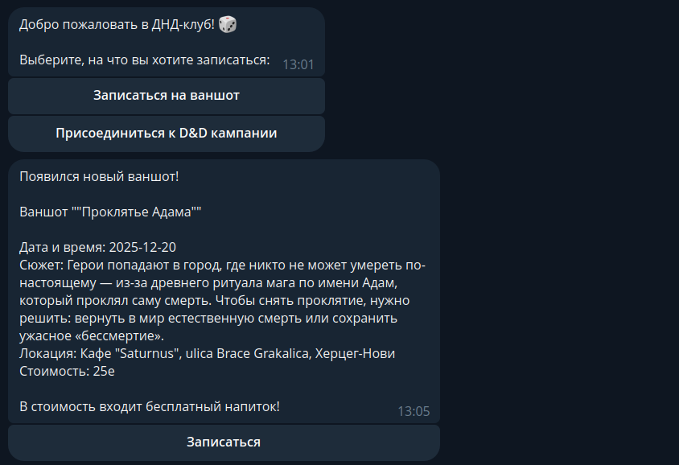
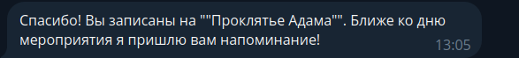
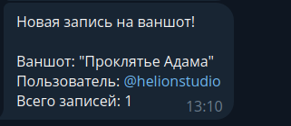

# Telegram-бот для D&D клубов
Привет! Меня зовут Валерия, я специализируюсь на разработке Telegram-ботов для различных целей. 

Данный бот был создан для D&D-клуба в Черногории, для записи на мероприятия и с удобной админ-панелью для регистрации новых игр. Протестировать можно здесь: https://t.me/dnd_montenegro_bot

## Что я предлагаю:

Разработка Telegram-ботов под ваши задачи
Интуитивный интерфейс для пользователей и админов
Автоматизация напоминаний, рассылок, сбора заявок
Гибкая настройка под ваш стиль и формат
Техническую поддержку после создания бота
Недорогое содержание на сервере

## Почему стоит работать со мной:

Недорогие решения и несколько ценовых предложений
Понимание воронки и вовлечения лидов
Чистый, поддерживаемый код (Python, SQLite)
Бесплатная или недорогая техническая поддержка после создания бота
Опыт внедрения и поддержки ботов в реальных клубах и для частных специалистов
Готова обсудить ваш проект и предложить оптимальное решение!
Свяжитесь со мной для консультации и примеров работ.

**ВНИМАНИЕ!**
Данный проект защищён авторским правом. Копирование, распространение и использование исходного кода запрещены без письменного разрешения автора. Подробнее — см. файл LICENSE.

